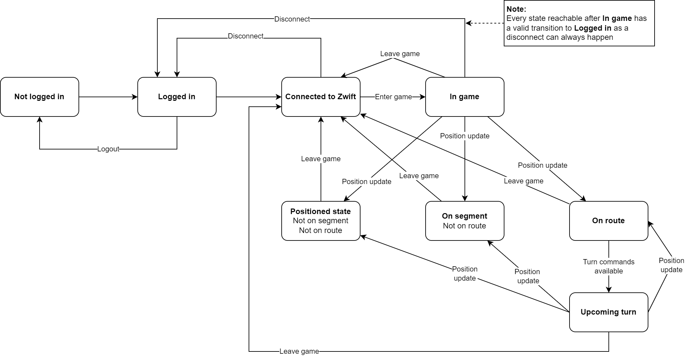

# RoadCaptain architecture

## Pairing

1. Get auth info: `GET https://us-or-rly101.zwift.com/api/auth`, JSON response contains URL for retrieving token
1. Get token `https://secure.zwift.com/auth/realms/zwift/protocol/openid-connect/token` 
```webforms
client_id	Zwift_Mobile_Link
username	>>ZWIFTUSERNAME<<
password	>>ZWIFTPASSWORD<<
grant_type	password
```
1. Get servers `GET https://us-or-rly101.zwift.com/api/servers`, JSON response contains `baseURL` to use
2. Check if needed: `GET https://us-or-rly101.zwift.com/api/profiles/me/`, JSON response contains player `id`
3. Initiate relay to Zwift app: `PUT https://us-or-rly101.zwift.com/relay/profiles/me/phone`, this will respond with a `204 No Content`, request payload:
```json
{
    "mobileEnvironment": {
        "appBuild": 1276,
        "appDisplayName": "Companion",
        "appVersion": "3.29.0",
        "systemHardware": "Google sdk_gphone_x86_64",
        "systemOS": "Android",
        "systemOSVersion": "11 (API 30)"
    },
    "phoneAddress": "10.0.2.16",
    "port": 21587,
    "protocol": "TCP"
}
```
the `phoneAddress` needs to be on the same network as the Zwift app

## System components

1. Pairing
2. Message receiver -> parse Protobuf messages and push to queue(?)
3. Position message listener -> Map position to road segment
4. Routing engine -> Determine if current segment changed and which action to do on upcoming junction

## Game States

RoadCaptain uses a state machine to model the interaction with Zwift.

The current iteration of the state diagram looks like this:



The implementation lives in `src/RoadCaptain/GameStates/`
