# Changelog

## 0.7.0.0

This release adds a new feature that brings the social aspect of Zwift to RoadCaptain: _route sharing_!

You can now share the routes you create in Route Builder with other Zwifters that use RoadCaptain as well as browse routes that other Zwifters have created 🎉🎉

Read more about how it works on [the RoadCaptain site](https://roadcaptain.nl/features/route-sharing/).

### Route Builder

- Add a menu item to go to the documentation on roadcaptain.nl
- It is now possible to import a route from [Zwift Map](https://zwiftmap.com/) into Route Builder. This saves you a lot of work to rebuild a route to make it work for RoadCaptain.
- The color scheme of the elevation plot has been changed to provide much clearer indication of the grade

### Runner

- **Windows only** Zwift credentials will now be stored securely in the Credential Manager instead of keeping them in memory only. This reduces the amount of times you'll need to log in to Zwift

#### Elevation plot

When riding hit <kbd>CTRL</kbd> + <kbd>E</kbd> / <kbd>META</kbd> + <kbd>E</kbd> to toggle the Elevation Plot window. This will allow you to see the elevation and grade of the route you are riding which helps you to plan your effort much easier than having to squint at the elevation plot for the entire route.

The Elevation Plot window has a few different modes:

- Show all: This shows the elevation profile for the entire route, an orange marker shows your position.
- Moving-window: This shows the elevation profile from your current position to the next 500m.

You can also enable KOM segment auto-zoom which will show the elevation profile of the KOM segment when you are on that segment. This is great for pacing and planning a KOM attack! This mode works with both the _Show all_ and _Moving-window_ modes. When you complete the segment the elevation plot switches back to the mode you originally chose.

You can toggle the mode by clicking the elevation plot window and using <kbd>CTRL</kbd> + <kbd>M</kbd> / <kbd>META</kbd> + <kbd>M</kbd>.

#### Bug fixes

- Resue the route after connection was lost. This should fix the remaining issue in [#107](https://github.com/sandermvanvliet/RoadCaptain/issues/107)
- Fixed a bug where a crash would occur because the map animation would continue running when the rider is already in-game.
- Fixed a bug where hitting <kbd>CTRL</kbd> + <kbd>X</kbd> / <kbd>META</kbd> + <kbd>X</kbd> in the in-game window when you are not yet in a game would not return to the main window.

## 0.6.11.0

### Runner

- Resue the route after connection was lost. This should fix the remaining issue in [#107](https://github.com/sandermvanvliet/RoadCaptain/issues/107)
- Add the ability to show the elevation plot for the current route by pressing <kbd>CTRL</kbd> + <kdb>E</kbd> / <kbd>META</kdb> + <kbd>E</kbd>
- The elevation plot now shows a view of the next 950m which helps you plan your effort much easier than having to squint at the elevation plot for the entire route.
- Fixed a bug where a crash would occur because the map animation would continue running when the rider is already in-game.
- Fixed a bug where hitting <kbd>CTRL</kbd> + <kbd>X</kbd> / <kbd>META</kbd> + <kbd>X</kbd> in the in-game window when you are not yet in a game would not return to the main window.

### Route Builder

- Add a menu item to go to the documentation on roadcaptain.nl

## 0.6.10.1

### Runner

- Fixed a bug that would prevent RoadCaptain from starting when the preferences have a recent route that was created with a newer version.
- Fixed a bug that would prevend RoadCaptain from entering the game because the position log file could not be created due to a wrong file path (see [#111](https://github.com/sandermvanvliet/RoadCaptain/issues/111), [#101](https://github.com/sandermvanvliet/RoadCaptain/issues/101) and possibly [#107](https://github.com/sandermvanvliet/RoadCaptain/issues/107))

## 0.6.9.0

With this release a lot of work has been done behind the scenes to keep the app running smoothly and to remove some of the quirks that were added while RoadCaptain was initially built. The sad thing is you won't see most of that but it does mean that things like exiting from an activity is now handled a lot smoother as well as the initial connection with Zwift (where it says "Waiting for Zwift" for example).

Ultimately you _should_ notice less quirky behaviour at times which means you can keep focusing on riding instead of checking whether the app still works!

There have also been a bunch of tweaks to the user interface to provide more and better information in both Route Builder and Runner. See below for the details!

### Route Builder

- Show the segment id when hovering over the segment name in the route list
- The window state (size and position) are now stored in the user preferences so that the next time you open Route Builder it appears where you left off.
- You can now zoom to your route by clicking the 4 outward pointing arrows in the toolbar. This will zoom in to show the entire route.
- Show sprints, KOMs and Strava segments along the route on the main screen and improved the styling of the KOM and sprint segments on the map to make it look more "Zwifty" [#51](https://github.com/sandermvanvliet/RoadCaptain/issues/51)
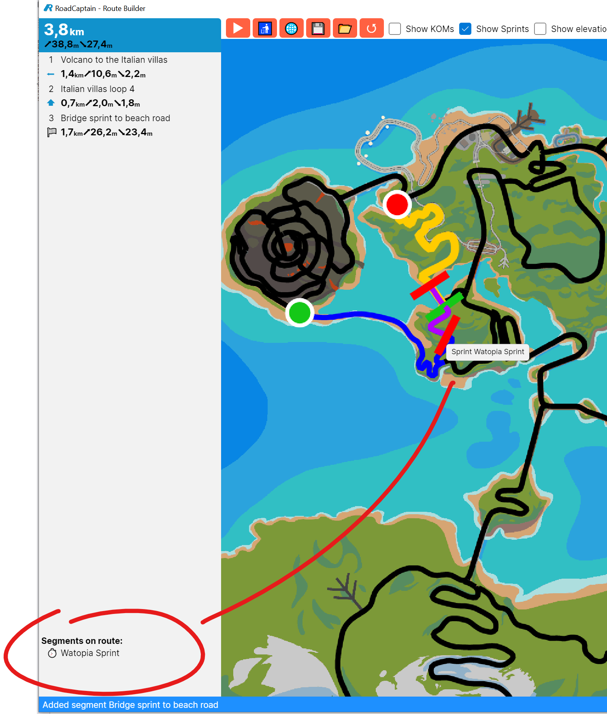
- Spawn point now show the direction so it's easier to understand in which direction you can build a route [#48](https://github.com/sandermvanvliet/RoadCaptain/issues/48), [#49](https://github.com/sandermvanvliet/RoadCaptain/issues/49): 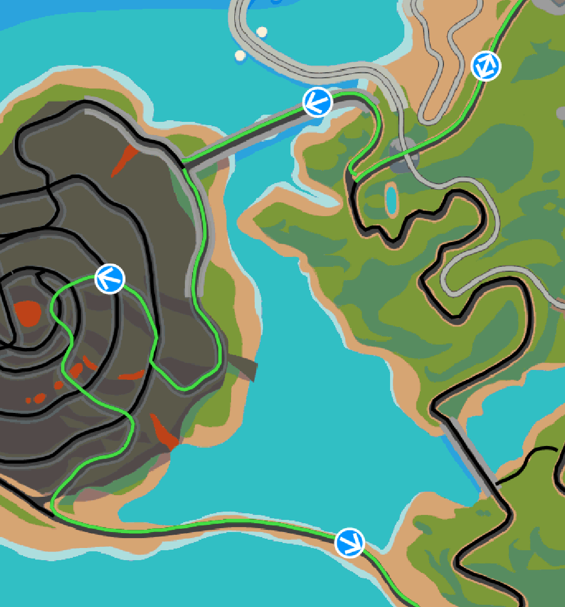
- The elevation plot now has colorized grade indications so you can see more easily how hard the cilmbs are! 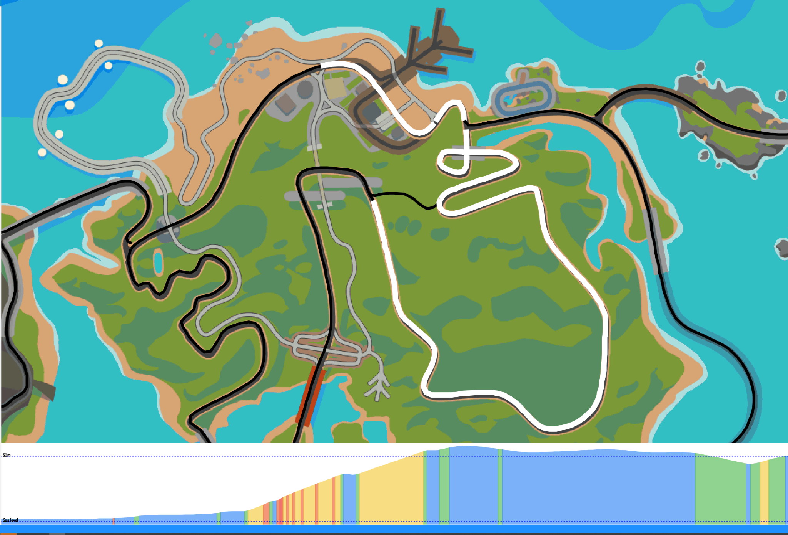
- The show climbs, show sprints and show elevation plot check boxes are now stored in the user preferences.
- Building loops has been improved so you don't get the "do you want to make a loop" question too often (and sometimes wrongly!)

### Runner

A big change in this release is the main screen of the Runner which has been updated to show the animated map of the route as well as the KOMs and sprints that you will pass along the route:
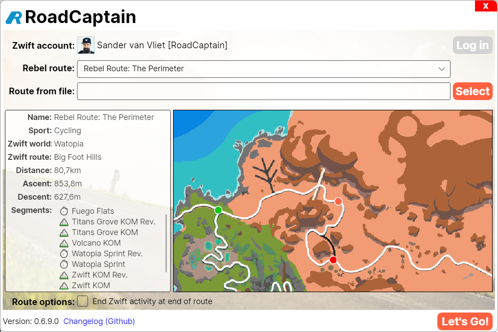

Additionally the following improvements and fixes have been made:

- Automatically re-initialize the Zwift connection when the connection secret doesn't match
- Removed the "Start new loop at end of route" as that is now handled by actual looped routes built with RouteBuilder
- Add diagnostic information on the Zwift connection attempts and data received
- Improve messages when starting a ride:
  - Show "Waiting for Zwift" when Zwift is not connected yet
  - Show "Connected with Zwift" when Zwift has connected but the activity hasn't started yet (or we didn't get an update yet!)
  - Show "Entered the game" when the activity starts
  - Show "Riding to start of route" when the activity started but you are not yet on the starting segment of the route
  - Show "Heading the wrong way" when you're on the starting segment of a route but heading in the wrong direction
- Fix an issue where RoadCaptain would flip between on/off route very quickly many times
- Fix an issue where the in-game window would only show the Zwift route to start without any other instruction when clicking "Let's go" and Zwift is not yet started
- Fix an issue where the in-game window would appear off-screen
- Fix an issue where the Zwift connection would not be initialized properly after a disconnect and subsequent re-connect
- Fix an issue where RoadCaptain would suddenly crash [#97](https://github.com/sandermvanvliet/RoadCaptain/issues/97)
- Fix an issue where RoadCaptain would go from _lost route lock_ back to _on route_ even though you're not on the route

### Routing

- Fixed an incorrect turn from Volcano Climb to Volcano Circuit 1, this also introduces version 3 of the stored route files.
- Remove segment watopia-gran-fondo-002 because it's not routable

## 0.6.7.0

### Runner

- Implement the Zwift [Konami Code](https://en.wikipedia.org/wiki/Konami_Code) to fix the issue with not being able to _go straight_ on a route [#91](https://github.com/sandermvanvliet/RoadCaptain/issues/91)

## 0.6.6.0

A Tour de France special: France is now available to plan routes!

Get into the TDF2022 mood by riding your custom routes in France. Allez Allez!

It's also time for some new features in Route Builder: you can now see the elevation plot of your route and planning a route with a loop has become much easier 👍 See below for details!

### Important note

With the release of Zwift 1.27 there are a few challenges for RoadCaptain as well as other 3rd party Zwift extensions.

Zwift introduced encrypted connections to make sure that no data will leak between Zwift, Zwift Companion and the Zwift back-end. Obviously this meant that RoadCaptain and other extensions could no longer communicate with the Zwift apps and for the most part that meant that all apps would no longer work.

Well, good news! This release adds support for encrypted connections!

Unfortunately there is some bad news too: Turn commands don't work very well anymore... 

This happens even when using the official Zwift Companion app, it looks like Zwift ignores the turn commands that are sent to it. I'm tracking this issue in [#99](https://github.com/sandermvanvliet/RoadCaptain/issues/99) and [#98](https://github.com/sandermvanvliet/RoadCaptain/issues/98) as well as on the official Zwift forum [here](https://forums.zwift.com/t/turn-commands-flaky-when-using-zwift-companion/586977) so stay tuned for updates in that area.

### Runner

- Show "What is new" dialog when opening Runner after installation or upgrade. This dialog will only be shown once. [#80](https://github.com/sandermvanvliet/RoadCaptain/issues/80)
- Fixed a bug where a GoStraight with GoStraight & Right turn commands available would result in Right instead of GoStraight causing you to lose route lock
- When riding on the lead-in to a loop the status bar in the bottom now shows that instead of telling you that you're on loop 1: 

### Route Builder

- Show "What is new" dialog when opening Runner after installation or upgrade. This dialog will only be shown once. [#80](https://github.com/sandermvanvliet/RoadCaptain/issues/80)
- You can now show an elevation plot of your route using the "Show elevation plot" toggle, KOM segments are visible too when those are enabled on the map [#31](https://github.com/sandermvanvliet/RoadCaptain/issues/31)
- Planning a route with a loop is now much better! Route Builder supports building a loop that has a lead-in before a loop. When creating the route, Route Builder will ask you whether you want to create a loop when the last added segment connects to your route. In the route segment list you can see the lead-in and the segments that form the loop:  [#95](https://github.com/sandermvanvliet/RoadCaptain/issues/95)
- The route name text box at the bottom of the segment list has been removed. You can now set the name of the route when saving it: 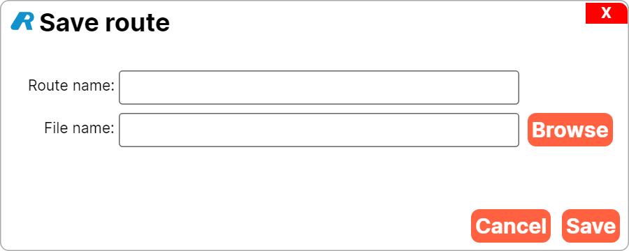 [#9](https://github.com/sandermvanvliet/RoadCaptain/issues/9)

### Routing

- [Makuri Islands] Add KOM and Sprint segments
- [France] Added segments, KOMs and Sprints [#12](https://github.com/sandermvanvliet/RoadCaptain/issues/12)

## 0.6.5.0

This release is the first release to add another Zwift world to RoadCaptain: Makuri Islands! 🎉🎉🎉

It is now possible to build routes in Makuri Islands and ride (or run!) them with RoadCaptain Runner. The segments and turns have all been automatically generated which saves a ton of time because I no longer have to ride each segment to find the junctions. You may find some issues around Neokyo because the routes overlap quite a bit there, on the rest of Makuri Islands you should be fine!

A quick look at planning a route on Makuri Islands:

As you can see the segment names still have the "technical" names, those will be updated soon but that's some manual work.

Behind the scenes there have been some changes to make it easier to support new worlds. In the last release we saw a few issues where the segment had incorrect turns defined which would break routing. To solve this for the future, RoadCaptain now automatically works out what the correct turn is based on what Zwift provides as turn commands.

Ride on!

The **[PREVIEW]** items should work but may have some quirks. Any feedback is more than welcome!

### Runner

- Makuri Islands is now available for beta testing [#7](https://github.com/sandermvanvliet/RoadCaptain/issues/7)
- Improved turn command to route mapping. This should prevent issues where RoadCaptain has different turns defined on a segment vs what Zwift reports.
- Show loop counter in the bottom bar of the in-game window. This makes it easy to see on which repetition of the loop you are:  

### Route Builder

- Makuri Islands is now available for beta testing [#7](https://github.com/sandermvanvliet/RoadCaptain/issues/7)
- Fixed a bug where the Zwift map would not be changed when switching worlds

## 0.6.4.0

### Runner

- Performance optimisation of game coordinate conversion. This is now roughly twice as fast which means that determining your position in-game happens much faster now and that means RoadCaptain can make routing decisions quicker!
- Fixed an issue where you had to log in again after exiting a Zwift activity
- Improved the positioning algorithm which fixes an issue where RoadCaptain would jump between segments in the Volcano causing the route to be lost [#77](https://github.com/sandermvanvliet/RoadCaptain/issues/77)
- Fixed an issue where the route lock would be lost when entering the last segment of a route
- Added a shortcut key <kbd>Ctrl</kbd>+<kbd>X</kbd> (Windows / Linux) <kbd>Cmd</kbd>+<kbd>X</kbd> (macOS) on the in-game window that ends the activity and returns you to the main screen
- Fixed an issue where RoadCaptain would not end the activity when completing a route [#92](https://github.com/sandermvanvliet/RoadCaptain/issues/92)

### Route Builder

- Fix an issue where an exception would occur when you load a route from the main screen of RouteBuilder. In this situation the segments aren't loaded yet which caused a crash to happen [#87](https://github.com/sandermvanvliet/RoadCaptain/issues/87)
- Clear highlighted segment when clearing the route [#88](https://github.com/sandermvanvliet/RoadCaptain/issues/88)
- Clear highlighted segment when returning to world/sport selection screen
- Fix issue where updating the command executable flag would fail because it is not on the UI thread and RouteBuilder would crash
- RouteBuilder now displays the official Zwift map 🎉 This makes it a lot easier to orient yourself when building a route [#90](https://github.com/sandermvanvliet/RoadCaptain/issues/90) and [#31](https://github.com/sandermvanvliet/RoadCaptain/issues/31)
- Fixed an issue with coordiante conversion which caused the wrong segment to be selected when two are close together
- Use the name of the route as the suggested file name when saving a route

### Routing

- [Watopia] Fix turn from Sequoia to Epic onto Ocean Boulevard 2 [#85](https://github.com/sandermvanvliet/RoadCaptain/issues/85)
- [Watopia] Fix turn from Ocean Boulevard 1 to Zwift KOM / Beach Road [#85](https://github.com/sandermvanvliet/RoadCaptain/issues/85)
- [Watopia] Removed the `watopia-four-horsemen-001 segment` segment because it's not used
- [Watopia] Removed the `watopia-beach-island-loop-003` segment because it's not used
- [Watopia] Improve handling of the 3-way junction at the start of Epic KOM [#73](https://github.com/sandermvanvliet/RoadCaptain/issues/73) and [#75](https://github.com/sandermvanvliet/RoadCaptain/issues/75)
- [Watopia] Fix turn from Italian Villas Loop 1 to Italian Villas Loop 4 [#84](https://github.com/sandermvanvliet/RoadCaptain/issues/84)

### Behind the scenes

- Removed the `HasLostLock` property and introduced the `LostRouteLockState`
- Ignore most of the properties of `PlannedRoute` when persisting it as they're only relevant in-game and don't need to be persisted.
- Saved routes will contain the version of RoadCaptain they are created with, this is for future use to handle changes to segments/turns
- Added coordinate offsets for all Zwift worlds
- Added coordinate conversion for Makuri Islands [#7](https://github.com/sandermvanvliet/RoadCaptain/issues/7)

## 0.6.3.1

I'm super happy to annouce that with version 0.6.3.1 RoadCaptain is now supported on macOS! 🎉🎉🎉

Over the last month and a bit the applications (RouteBuilder and Runner) have been ported to the [Avalonia UI](https://avaloniaui.net/) framework which makes it possible to support multiple platforms with a single codebase.
That also paves the way for a Linux version in the future.

For now the macOS build is based on the pre-M1 architecture which means that RoadCaptain will run using Rosetta and not yet natively on ARM devices. This has to do with the webview component that is used to log in to Zwift, there are still some issues with packaging that need to be resolved before that becomes available.

Another big change is that it is no longer required to install the .Net Core runtime. Both the Windows and macOS builds are now stand alone applications which means that installation is much simpler now.

**Known issues:**

A number of routing issues were found (see [#84](https://github.com/sandermvanvliet/RoadCaptain/issues/84), [#82](https://github.com/sandermvanvliet/RoadCaptain/issues/82), [#77](https://github.com/sandermvanvliet/RoadCaptain/issues/77), [#75](https://github.com/sandermvanvliet/RoadCaptain/issues/75), [#73](https://github.com/sandermvanvliet/RoadCaptain/issues/73) and [#72](https://github.com/sandermvanvliet/RoadCaptain/issues/72)). These are still under investigation and should be addressed in the next build.

### Route Builder

- Buttons no longer drop off the screen when resizing the window. [#55](https://github.com/sandermvanvliet/RoadCaptain/issues/55)
- Tooltips are now visible on buttons. [#40](https://github.com/sandermvanvliet/RoadCaptain/issues/40)
- When saving a route and the first and last segments are connected, Route Builder will ask you whether to make the route a loop. [#59](https://github.com/sandermvanvliet/RoadCaptain/issues/)
- The map now no longer drops off the side of the screen. [#55](https://github.com/sandermvanvliet/RoadCaptain/issues/55)
- The map looks a bit nicer now, anti-aliasing improves the smoothness of the segments.
- Tooltips are now shown on KOMs and Sprints so that you can see which ones they are.

### Runner

- **[PREVIEW]** Automatically end the Zwift activity after completing the route [#58](https://github.com/sandermvanvliet/RoadCaptain/issues/58)
- **[PREVIEW]** Start another loop of the route if the route is a loop [#59](https://github.com/sandermvanvliet/RoadCaptain/issues/59). When you select this option, the "end activity" option is automatically disabled.
- User preferences have been simplified, on Windows there is only 1 directory left instead of 2. [#74](https://github.com/sandermvanvliet/RoadCaptain/issues/74)
- When you end the activity in Zwift, the Runner will automatically return to the start screen. [#67](https://github.com/sandermvanvliet/RoadCaptain/issues/67)
- Show a message when route lock is lost, now you'll see when RoadCaptain loses track in-game. [#66](https://github.com/sandermvanvliet/RoadCaptain/issues/66)
- The new version popup now shows properly formatted content instead of raw Markdown. [#61](https://github.com/sandermvanvliet/RoadCaptain/issues/61)
- When selecting a route the details now also show distance, ascent and descent. [#51](https://github.com/sandermvanvliet/RoadCaptain/issues/51)
- A message box is shown when another instance of RoadCaptain Runner is already running.

The **[PREVIEW]** items should work but may have some quirks. Any feedback is more than welcome!

## 0.6.2.1

**Breaking change:**

Due to changes in the turns for Watopia (see [issue #62](https://github.com/sandermvanvliet/RoadCaptain/issues/62)), routes that traversed the Jungle Loop Switchback segment won't work properly anymore. You will have to rebuild the route to make those routes work again.

### Route Builder

- Migrate settings from previous installed version of RoadCaptain so that settings are preserved ([issue #60](https://github.com/sandermvanvliet/RoadCaptain/issues/60))
- Reset route name when clearing the route, opening a route or navigating back to the world selection screen ([issue #54](https://github.com/sandermvanvliet/RoadCaptain/issues/54))

### Runner

- Migrate settings from previous installed version of RoadCaptain so that settings are preserved ([issue #60](https://github.com/sandermvanvliet/RoadCaptain/issues/60))
- Fix an issue where progress would not be tracked on the last segment of the route ([issue #64](https://github.com/sandermvanvliet/RoadCaptain/issues/64))
- Fix an issue where the Let's Go! button would remain grey after logging in and selecting a Rebel Route ([issue #65](https://github.com/sandermvanvliet/RoadCaptain/issues/65))
- Handle 3-way junctions properly when only left/right turn commands are received from Zwift ([issue #57](https://github.com/sandermvanvliet/RoadCaptain/issues/57))

### Routing

- [Watopia] Fix the turn at the end of the Jungle Loop Switchback towards the Jungle Loop Rope Bridge segment ([issue #62](https://github.com/sandermvanvliet/RoadCaptain/issues/62))

## 0.6.2.0

### Route Builder

- Add button to remove last segment ([issue #36](https://github.com/sandermvanvliet/RoadCaptain/issues/36))
- Enable buttons only when they would have an effect (disables reset, save, simulate when on the world selection view) ([issue #39](https://github.com/sandermvanvliet/RoadCaptain/issues/39))
- Fix a visual bug where the start/end markers of the route would be reversed if the spawn point segment has a reverse direction.
- Add spawn point just before the Fuego Flats finish arch which is from the Triple Flat Loops route ([issue #38](https://github.com/sandermvanvliet/RoadCaptain/issues/38))
- Add spawn point in the volcano which is from the Tour of Fire and Ice route ([issue #38](https://github.com/sandermvanvliet/RoadCaptain/issues/38))
- Open and save file dialogs now re-open at the last used location instead of always defaulting to My Documents ([issue #27](https://github.com/sandermvanvliet/RoadCaptain/issues/27))
- The map now supports mouse-wheel / pinch zoom ([issue #44](https://github.com/sandermvanvliet/RoadCaptain/issues/44))

### Runner

- Open file dialog now re-opens at the last used location instead of always defaulting to My Documents ([issue #27](https://github.com/sandermvanvliet/RoadCaptain/issues/27))
- You can now select the Rebel Routes from Zwift Insider as pre-built routes ([issue #28](https://github.com/sandermvanvliet/RoadCaptain/issues/28)):
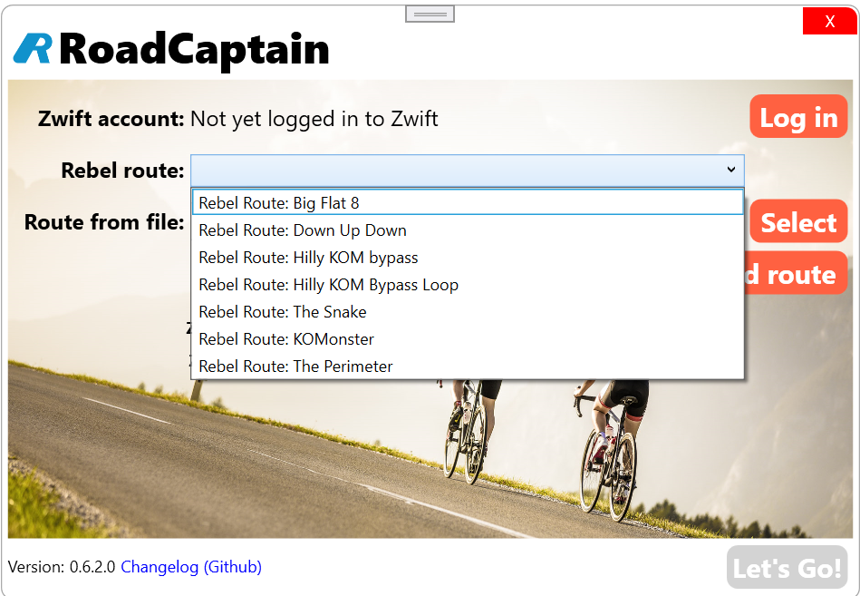
- Preent multiple instances of RoadCaptain from starting ([issue #53](https://github.com/sandermvanvliet/RoadCaptain/issues/53)):

### Routing

- [Watopia] Fix the turn at the end of the Volcano to Villas segment ([issue #41](https://github.com/sandermvanvliet/RoadCaptain/issues/41))
- [Watopia] Add right-turn from Italian Villas loop 4 to Italian Villas loop 3 ([issue #37](https://github.com/sandermvanvliet/RoadCaptain/issues/37))

## 0.6.1.0

### Route Builder

- Fix issue where loading a route for a different sport than the default sport fails
- Show route start and end markers on the map ([issue #31](https://github.com/sandermvanvliet/RoadCaptain/issues/31))
- Show KOM start (red), finish (green) and segment (orange) on the map ([issue #31](https://github.com/sandermvanvliet/RoadCaptain/issues/31)):
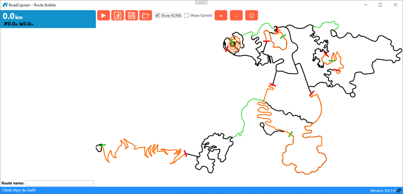
- Show sprint start (red), finish (green) and segment (purple) on the map ([issue #31](https://github.com/sandermvanvliet/RoadCaptain/issues/31)):

- Fixed a layout issue where the buttons would overlap the map if the window is resized to a relatively small size.
- Show a warning when you select a segment that can't be reached from the spawn point ([issue #33](https://github.com/sandermvanvliet/RoadCaptain/issues/33))
- Fix issue where the route path direction would be incorrect for the starting segment when the direction is reversed. This would show the start marker on the wrong end of the starting segment ([issue #33](https://github.com/sandermvanvliet/RoadCaptain/issues/33))
- It is now possible to zoom and pan the map view ([issue #29](https://github.com/sandermvanvliet/RoadCaptain/issues/29)):
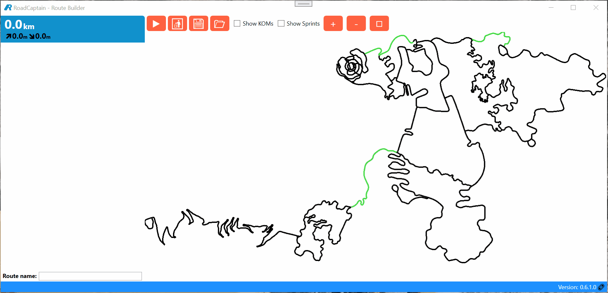

### Runner

- Fix issue where the Runner would show `RoadCaptain.World` instead of `Watopia` as the world name after loading a route.
- Fix issue where the Runner would show `RoadCaptain.World` instead of `Watopia` as the world name in the in-game window.

## 0.6.0.0

This is a big release with two items that will make RoadCaptain a lot more versatile!

With this release the RoadCaptain UI has been prepared to support multiple worlds! You'll no longer be stuck in Watopia but can also build routes in Makuri Islands 🎉🎉
All Zwift worlds are visible in Route Builder but for now only Watopia is selectable, the other worlds need to be added still.

As well as multiple world support, RoadCaptain now also supports running!
When you start the Route Builder you'll see the option to select a sport to build a route for. Especially for Watopia where there are dedicated run segments you can now include those on your routes!

Have a look at the new RoadCaptain Route Builder:

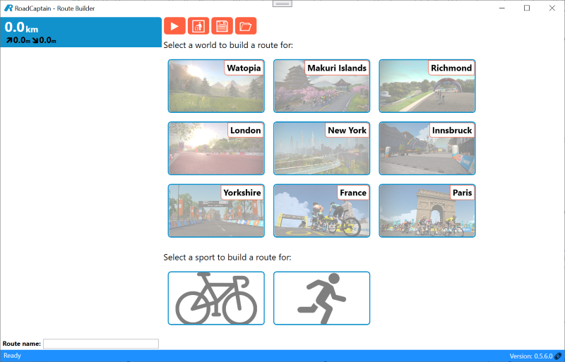

The RoadCaptain Runner now also displays the world and sport of a route when you select it:
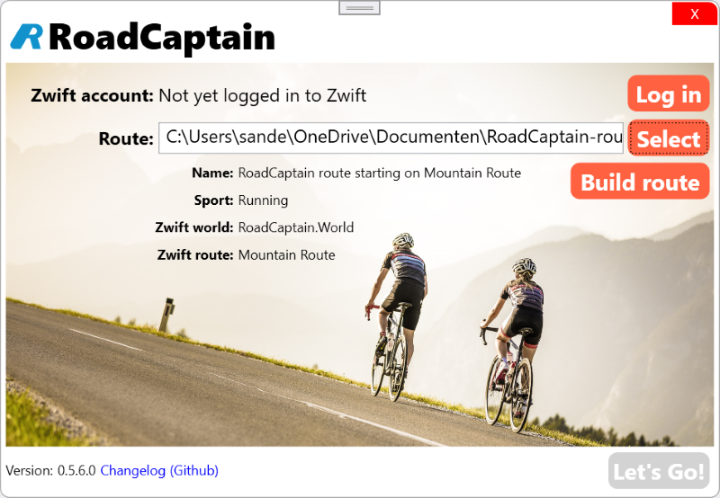

Of course the Runner will also tell you to either start cycling or running depending on the sport type of the route 😉

And there are a lot of other tweaks and fixes in this release:

### Route Builder

- **[Watopia]** Split the spwan point segment along the beach to for the new junction to Jons Route (running only)
  Routes that were created prior to this release will still work, RoadCaptain automatically corrects to the right spawn point
- **[Watopia]** Cleaned up the segments at the end of the beach so it looks a bit better
- **[Watopia]** Removed a segment from the cycling starting pens as that's only reachable from events
- **[Watopia]** Running segments are now included, they are only visible when you select running as the sport to build a route for
- **[Makuri Islands]** Added segments and spawn points, this is very much a work in progress still.
- **[User Experience]** When you select a sport for the first time RoadCaptain will ask you to use it as the default sport.

### Runner

- Sport type is now shown when you select a route
- The messages shown by the runner when waiting for Zwift to connect or an activity to start will now use the right term. For example: _Start running..._ / _Start cycling..._

## 0.5.6.0

- The runner and route build now use unicode arrow glyphs instead of images for the turn indicators because it looks a bit cleaner as the images don't scale very well.

### Route Builder

- When removing the last segment, the new last segment in the route list will be automatically selected.

## 0.5.5.0

- When starting, both the runner and route builder will now check if there is a new release available and shows a window to inform you if there is: 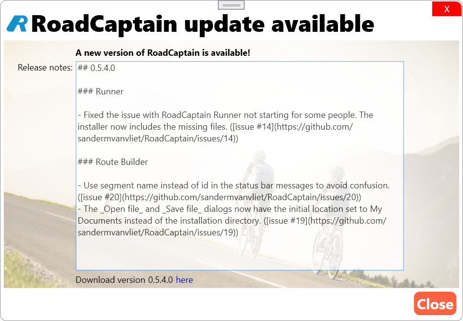 ([issue #15](https://github.com/sandermvanvliet/RoadCaptain/issues/15))

### Route Builder

- Dialogs should now appear in or over the main window instead of outside of it. ([issue #26](https://github.com/sandermvanvliet/RoadCaptain/issues/26))
- Fix an issue where opening a route after removing all segments of the current route would ask you to save the route first. ([issue #25](https://github.com/sandermvanvliet/RoadCaptain/issues/25))
- When adding the starting segment the name is now shown in the status bar instead of just "Added segment". ([issue #24](https://github.com/sandermvanvliet/RoadCaptain/issues/24))

## 0.5.4.0

### Runner

- Fixed the issue with RoadCaptain Runner not starting for some people. The installer now includes the missing files. ([issue #14](https://github.com/sandermvanvliet/RoadCaptain/issues/14))

### Route Builder

- Use segment name instead of id in the status bar messages to avoid confusion. ([issue #20](https://github.com/sandermvanvliet/RoadCaptain/issues/20))
- The _Open file_ and _Save file_ dialogs now have the initial location set to My Documents instead of the installation directory. ([issue #19](https://github.com/sandermvanvliet/RoadCaptain/issues/19))

## 0.5.3.0

- Desktop shortcuts for both the Runner and Route Builder will be created when installing RoadCaptain ([issue #5](https://github.com/sandermvanvliet/RoadCaptain/issues/5))
- Most segments now have a more descriptive name than `watopia-foo-bas-001-after-before-before` which should make things a lot easier to read. This is a _work in progress_ and may see changes later. ([issue #6](https://github.com/sandermvanvliet/RoadCaptain/issues/6))

### Runner

- Add better logging of errors during start up. ([issue #14](https://github.com/sandermvanvliet/RoadCaptain/issues/14))

### Route Builder

- Fixed bug #8 where you could not leave segment `watopia-four-horsemen-002-before` ([issue #8](https://github.com/sandermvanvliet/RoadCaptain/issues/8))
- Add better logging of errors during start up. ([issue #14](https://github.com/sandermvanvliet/RoadCaptain/issues/14))
- Route Builder will now show a message when you can't select a segment because it's unsupported: 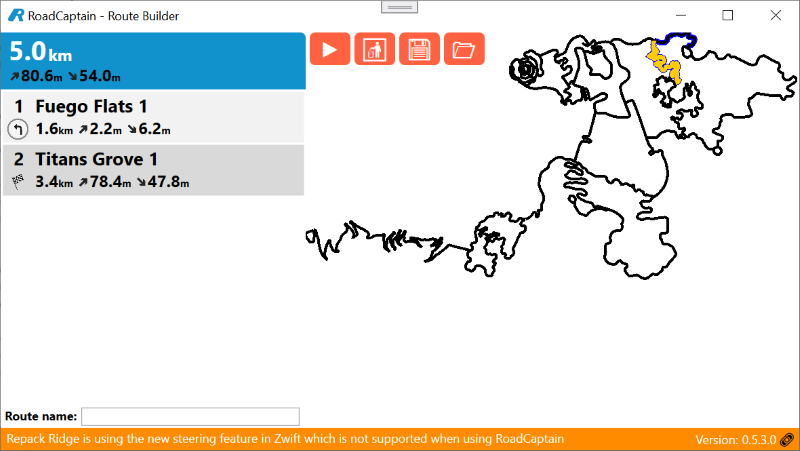
See: ([issue #3](https://github.com/sandermvanvliet/RoadCaptain/issues/3)) and ([issue #13](https://github.com/sandermvanvliet/RoadCaptain/issues/13))
- Added missing turn information for the loop at the start side of [Tempus Fugit](https://zwiftinsider.com/route/tempus-fugit/) on Fuego Flats. ([issue #13](https://github.com/sandermvanvliet/RoadCaptain/issues/13))
- You can now delete the last selected segment from the route by either pressing <kbd>Ctrl</kbd>+<kbd>Z</kbd> or selecting it in the list and pressing <kbd>Del</kbd> ([issue #4](https://github.com/sandermvanvliet/RoadCaptain/issues/4))

## 0.5.2.0

### Runner

- Fixed a bug where the in-game window would show only `Waiting for Zwift connection...` and the route name without giving any instructions when RoadCaptain is started but Zwift is not.
- When you've completed your route the in-game window now shows that a lot better: 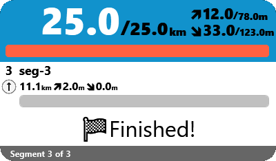 
(when you're on the last segment of the route the finish flag is not yet visible 😉)
- Tweaked the in-game UI to use black text for the ascent/descent numbers instead of gray because it looks a bit better.

## 0.5.1.0

### Runner

- Fixed a bug where the elapsed ascent and descent would have a negative sign even though the numbers would increase.

## 0.5.0.0

### Runner

- Added a button to launch the Route Builder directly from the runner
- The version of RoadCaptain is now shown in the main window and has a link to the changelog
- When a route is selected the main window now displays the name, world and Zwift route: 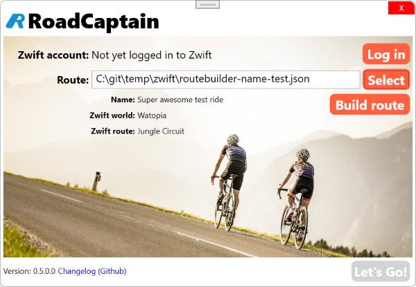

### Route Builder

- When a segment is selected in the list it will be highlighted in green on the map
- Fix the direction of segment `watopia-bambino-fondo-001-after-after-before-before-before` which was in reverse
- Routes can now be saved as GPX files so that they can be imported in other tools
- You can now set a custom name for the route, previously this was always set to the Zwift route name you would start on
- The version of RoadCaptain is now shown in the status bar and has a link to the changelog

## 0.4.0.0

- Fix issue in building the installer

### Runner

- Reworked state machine to improve interaction with Zwift. This is mostly a "behind the scenes" change but it does improve the reliability of pairing with Zwift.

## 0.3.0.0

- Changed from .Net 5 to .Net 6 because version 5 is end-of-life per 8th of May 2022

### Runner

- Log files are now written to `%UserProfile%\AppData\Local\Codenizer BV\RoadCaptain`. This fixes an issue where log files wouldn't be written at all because RoadCaptain doesn't have write access to the installation directory (`Program Files (x86)\RoadCaptain`)
- RoadCaptain will now show an error message if it can't connect to the Zwift back-end to initiate the game pairing
- If the connection with Zwift is lost, RoadCaptain will show a message and re-initiates the game pairing

## 0.2.0.0

In this release you no longer will be asked for your username and password for Zwift, instead you'll be taken to the Zwift website to log in.

This means you won't have to worry that RoadCaptain sees our username and password for Zwift.